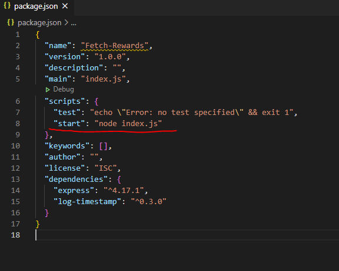
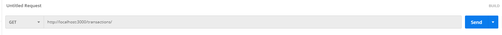
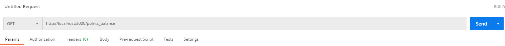
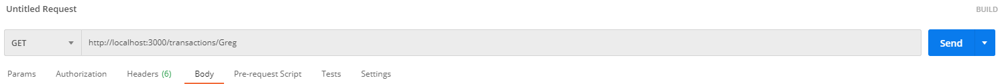
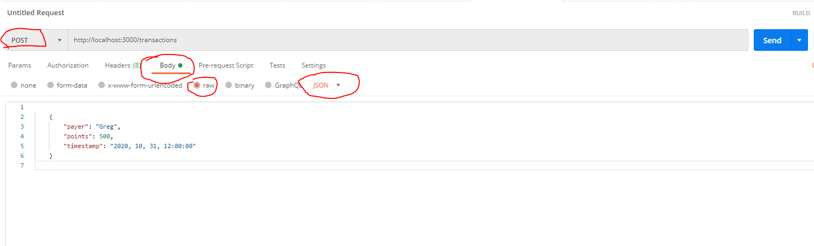
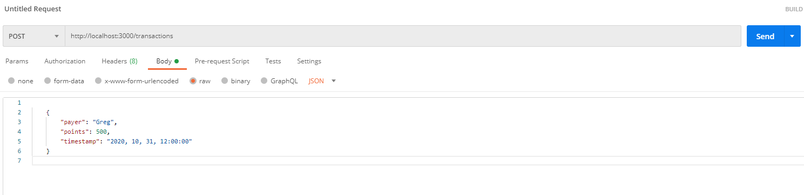
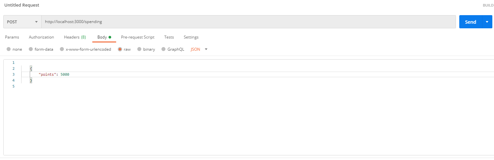

# Implementing Fetch Reward's Back End Challenge

In this coding exercise, I have written a web service that accepts HTTP requests that returns responses based on the outlined conditions below.

### Background
Our users have points in their accounts. Users only see a single balance in their accounts. But for reporting purposes we actually track their
points per payer/partner. In our system, each transaction record contains: payer (string), points (integer), timestamp (date). 


For earning points it is easy to assign a payer, we know which actions earned the points. And thus which partner should be paying for the points. 


When a user spends points, they don't know or care which payer the points come from. But, our accounting team does care how the points are
spent. There are two rules for determining what points to "spend" first:
* We want the oldest points to be spent first (oldest based on transaction timestamp, not the order they’re received)
* We want no payer's points to go negative.

### The Expected Result Of This Exercise
Routes will need to be provided that:
* Add transactions for a specific payer and date.
* Spend points using the rules above and return a list of { "payer": <string>, "points": <integer> } for each call.
* Return all payer point balances.

## How To Setup Locally
First off, this repo utilizes JavaScript and thus uses Node.js.  If you don't currently have it downloaded on your computer, the link is here to download:
https://nodejs.org/en/


Once you have node installed you will need to make sure you have the packages installed in your editor through the terminal.
```
npm install
```
```
npm init -yes
```
```
npm install express
```


You should now be good to go to run the server and to do that all you have to do in the terminal is enter:
```
npm start
```
This will run the server and tell you which port to use.  The port number will be based on your local environment, but it defaults to 3000, so for purposes of the examples below I will use 3000, but please use the port number displayed in your log after running npm start.


If for some reason npm start doesn't work, the script might not be included when you cloned the repo.  Check the package.json file and check the "start script" to make sure its there.





## Running The Server
Once you're up and running you will need an API platform to see the server in action.  You may have experience with other platforms and can use them, but for these examples and my personal preference I use and recommend Postman.  The link to download Postman is here: https://www.postman.com/downloads/


Now, with Postman up and running, to start you enter the following address in the address bar in postman.


Also make sure the associated request matches that path, for example a GET request will have a different outcome than a POST request if it has the same endpoint.


Here are the following paths.  
EVERY PATH will begin with http://localhost:3000 (or whichever port your server is running on) so when a path below is listed as /transactions , it means the full path to be entered will be http://localhost:3000/transactions.

# GET REQUESTS


## GET /transactions

Shows all current transactions
## GET /points_balance 

Shows the total balance of each users points balance
## GET /transactions/payername 

Shows every individual transaction made by the account name entered in the path.
* For example, if you wanted all the transactions made by the payer named Greg.  You would GET http://localhost:3000/transactions/Greg'

# POST REQUESTS
Post requests require you to enter various information related to that request when sending.  
When entering a post in Postman, you need to use the proper format and in the right section.  For all POST requests below you will need to be under the "Body" tab, then click "raw", and then set the text to JSON.


If you do not enter the information in the correct format or meet the specified requirements you will get an error message.
I will include the format and what is required to post for each path.

## POST /transactions

Will add a new transaction with a name, points, and timestamp the user enters.
```
{
    "payer": "Name",
    "points": 100,
    "timestamp" "2020, 10, 31, 12:00:00"
}
```
* The name has to be more than three letters
* The points has to be a number
* The timestamp follows the format of "year, month, day, hours:seconds:milliseconds"

## POST /spending

```
{
    "points": 5000
}
```
* Points have to be a positive number

Will spend points entered, taken out of current account transactions based on the two primary rules:
* The oldest transaction's points will be spent first.
* No payer's points go negative.
If entered correctly, you will get a message showing the amount of points taken out of each account by payer.  You can then use one of the above GET paths to see their updated points totals.


### Final Note
Lastly, in the index.js file near the top, there are five sample transactions ready-to-go to pre-populate when server starts just so you have examples to use instead of manually entering a bunch of sample transactions, simply un-comment them out by deleting the // or ctrl + /.


Thanks!


